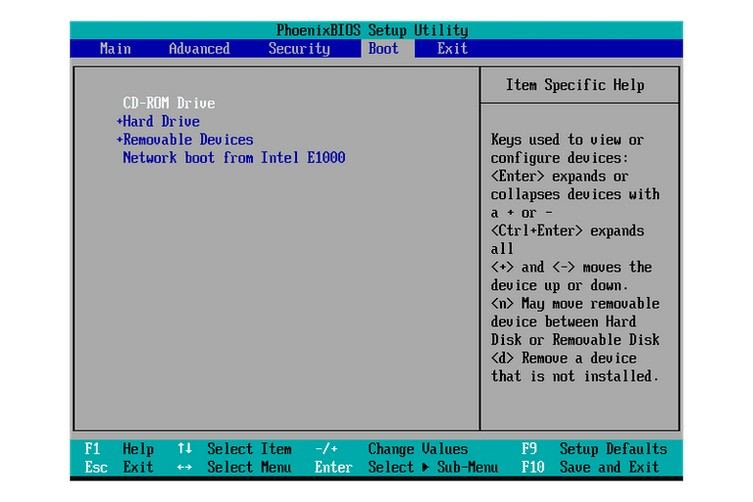
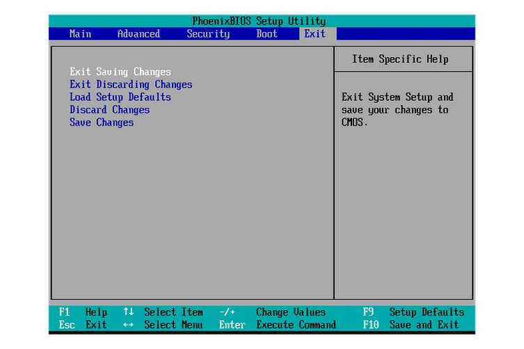
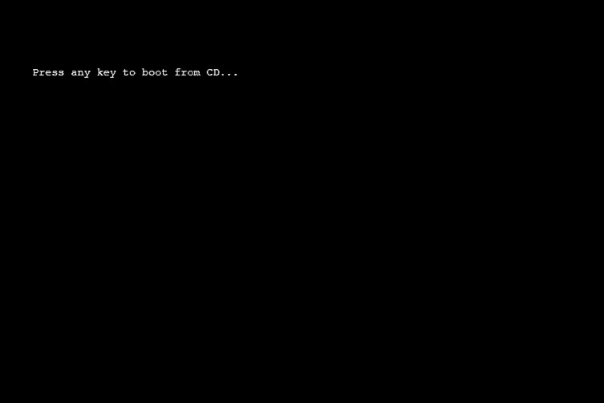

# 2. Configurar la prioridad de arranque en la BIOS

> ***La BIOS es donde puedes cambiar la configuración del orden de arranque.***

- [Volver al índice](save_old_pc.md)
- [Recuperación de datos](data_recovery.md)

### 2.1. Enciende la lap y espera por el mensaje de configuración de la BIOS.

> ***La pantalla de carga es donde sale la marca "Dell", "Gateway" u otra marca, casi siempre ahí indica que tecla es la buena.***

- Ahora, en mi experiencia, siempre me ha tocado que sea F11 o F8 para entrar a la BIOS.
- **Inmediatamente** comienza a pulsar la tecla para entrar en la BIOS (en algunos otros casos puede ser F2, F7, Del).
- **Presiónala varias veces, puedes probar varias a la vez.**

### 2.2. Accede a la utilidad de configuración de la BIOS

> ***Si de plano se ve confusa tu BIOS, busca un video en YouTube con el modelo de tu lap y "BIOS"***

- Luego de presionar el comando correcto del paso previo en el teclado, accederás a la utilidad de configuración de la BIOS. Los cambios en el orden de arranque son realizados en el menú Boot.

### 2.3. Localizar las opciones de orden de arranque en la BIOS

> ***¡Recuerda, tu BIOS puede presentar instrucciones diferentes!***

- Para seleccionar qué dispositivo arrancará primero, sigue las instrucciones en la pantalla de la utilidad de setup la BIOS para cambiar el orden de arranque. En este ejemplo de BIOS, el orden de arranque puede ser modificado utilizando las teclas + y -. A veces es con Arriba / Abajo.

## 2.4 Haz cambios en el orden de arranque

> ***La idea es llevar CD/USB como 1ra opción y Disco duro como 2da opción.***

- La BIOS ahora buscará primero la USB booteable conectada en algún puerto, antes de intentar arrancar desde el disco duro.

## 2.5 Guardar los cambios

- Sigue las instrucciones de la BIOS para navegar hacia el menú de ***"Exit" o "Save and Exit"***.

## 2.6 Confirma los cambios

> ***Asegúrate de confirmar los cambios antes de reiniciar. Si piensas seguir con la extracción de datos, ya puedes conectar ambas USBs.***

- Lee el mensaje cuidadosamente para asegurarte que te encuentras efectivamente guardando tus cambios y no saliendo sin guardarlos. A veces sale medio raro ese mensaje.

## 2.7 Inicia la lap con el nuevo orden de arranque

---

Continúa con:
- [Volver al índice](save_old_pc.md)
- [Recuperación de datos](data_recovery.md)
